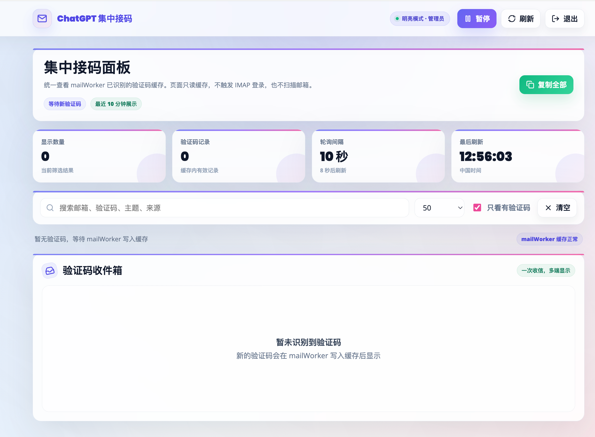

# ChatGPT 专属邮箱接码

基于 [rtunazzz/hidemyemail-generator](https://github.com/rtunazzz/hidemyemail-generator) 二次开发。

这个项目保留 iCloud Hide My Email 批量生成能力，并新增 Cloudflare Worker + Durable Object 接码面板：

- `ChatGPT 集中接码`：管理员登录后统一查看所有已识别验证码。
- `ChatGPT 专属邮箱接码`：每个邮箱拥有独立永久链接，链接中不暴露邮箱地址。
- `mailWorker` 统一连接 iCloud IMAP，一次收信，多端显示，前端只读缓存。
- 每个邮箱使用随机 `accessToken`，不再使用统一 `auth_code`。
- GitHub 仓库不包含真实 `wrangler.toml`、iCloud 密码、Apple Cookie、邮箱列表、专属链接。

## 界面预览

### ChatGPT 集中接码



### ChatGPT 专属邮箱接码


## 项目结构

```text
cloudflare-receiver-ccwu/   主接码 Worker，包含集中面板、专属接码页、mailWorker
cloudflare-receiver/        旧域名代理 Worker，用来兼容旧链接
source/hidemyemail-generator-main/  本地二改生成器工作目录
docs/screenshots/           GitHub README 预览图
```

## Cloudflare 部署

进入主 Worker 目录：

```powershell
cd cloudflare-receiver-ccwu
Copy-Item .\wrangler.example.toml .\wrangler.toml
```

修改 `wrangler.toml` 中的域名和非敏感配置。真实密码用 Cloudflare Secret 设置：

```powershell
npx wrangler secret put HME_IMAP_PASSWORD
npx wrangler secret put PANEL_PASSWORD
npx wrangler deploy
```

旧域名代理 Worker：

```powershell
cd cloudflare-receiver
Copy-Item .\wrangler.example.toml .\wrangler.toml
npx wrangler deploy
```

## 安全说明

不要提交以下文件：

- `wrangler.toml`
- `.dev.vars`
- `.wrangler/`
- `cookies.txt`
- `emails.txt`
- `receiver_urls.txt`
- iCloud App 专用密码
- Cloudflare API Token
- Apple Cookie

这些已经在 `.gitignore` 中默认忽略。

## 原项目说明

原始项目用于自动生成 Apple iCloud Hide My Email 地址，需要有效 iCloud+ 订阅。本仓库是在其基础上，为个人接码面板和 Cloudflare 部署做的二次开发。

原项目： [rtunazzz/hidemyemail-generator](https://github.com/rtunazzz/hidemyemail-generator)

## License

沿用原项目 MIT License。
